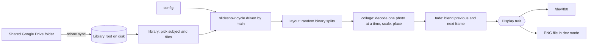

# Architecture

## Data flow

Per slide: pick a subject, choose `tiles` images from it, compute a layout for the frame size,
render the collage into the "next" frame, cross-fade from "previous" to "next" through the
`Display`, then hold for `interval_secs`. "Next" becomes "previous" and the cycle repeats.

## Modules

| Module | Role |
| --- | --- |
| `config` | Parse TOML, apply defaults, validate |
| `layout` | Pure function from (size, tiles, gap, RNG) to tile rectangles |
| `library` | Read `Config/subjects.json` and resolve uuids to files in `Processed/` |
| `hebrew` | Pure Gregorian to Hebrew date conversion |
| `family` | Read `Config/family.json`; who has a birthday today, as subjects |
| `collage` | Decode, scale and place photos into a frame |
| `display` | `Display` trait; framebuffer and PNG implementations |
| `fade` | Blend two frames into a scratch frame, push each step to a `Display` |
| `slideshow` | One cycle: rescan, pick a subject, build a collage, fade it in |
| `main` | CLI parsing, logging, display selection, the loop |

## Memory budget at 1920x1080

Memory, not speed, is the design constraint: a new collage is only needed every few minutes
(`interval_secs`, default 300), so the code trades CPU time for a small, predictable footprint.

| Item | Size |
| --- | --- |
| Current frame, RGB (1920 x 1080 x 3) | about 6.2 MB |
| Next frame, RGB (the canvas being built) | about 6.2 MB |
| Blend scratch frame, RGB | about 6.2 MB |
| Encode buffer in framebuffer pixel format (32 bpp) | about 8.3 MB |
| Steady state while a slide is on screen | about 21 MB |
| Peak while building a collage | about 98 MB measured (12 MP photos) |

The peak is measured by `tests/memory.rs` with `dhat` and checked against a 128 MB budget. It is
dominated by one decoded photo (36 MB as RGB at 12 MP) plus decoder and resize scratch buffers
(which grow with tile size). Pictures are decoded one at a time and dropped before the next, so
the peak does not grow with the number of tiles. A single picture is refused above 256 MB of
decode memory. That leaves most of the 1 GB for the OS and page cache; the systemd unit also
sets `MemoryMax` as a safety net. These are desktop measurements; the board has not been
profiled yet.

## Why the framebuffer

The board only has to show pictures on a TV. Writing to `/dev/fb0` needs no X server, no
Wayland compositor and no GPU stack, which saves RAM, boot time and moving parts. The cost is
that the program must respect the framebuffer's geometry (`virtual_size`, `stride`,
`bits_per_pixel`) and convert its frames to that pixel format.

## Why the fade is designed this way

- Both frames already exist in memory when the fade starts, so each step is a per-pixel linear
  blend of two buffers into a reused scratch frame. No decoding happens during the fade.
- The scratch frame is converted into the encode buffer and written to the display once per step,
  so the fade cost is bounded by memory bandwidth, not by image size on disk.
- The `Display` trait receives finished frames, so the fade is testable with a fake display and
  the same code drives both the framebuffer and the PNG dev output.
